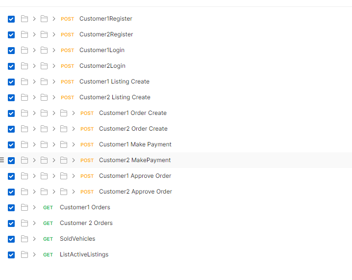

# yellow-site
Car Selling Platform

## Getting Started
Yellow Site Application developed with .net 6. Includes Unit Tests and Web Api

### Prerequisites

You need to install latest version of [VisualStudio 2022](https://visualstudio.microsoft.com/tr/downloads/) with that modules;
```
.NET 6 Runtime
```
If .net core runtimes not installed you can install from this [link](https://dotnet.microsoft.com/download)


## Run On Docker
in command line go to solution folder and run to build images
```
docker-compose build
```

After that get the servers up
```
docker-compose up
```
and then you can access the swagger like below

* http://localhost:8080/swagger
 
 ## Test On Postman
 You can test all cases with postman collection which is included in repository

[Download Postman Collection](./Api.postman_collection.json)

  
  ## Authors

* **Cem YILDIZ**
 

  
